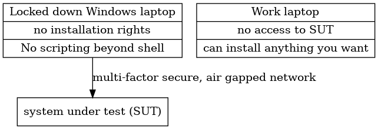
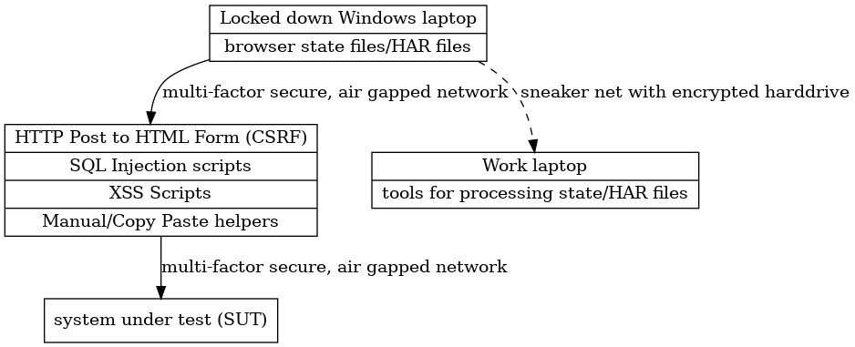
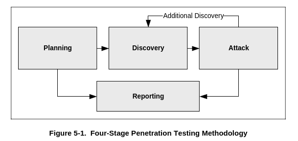
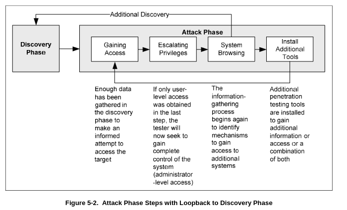

# ‘Tis evening on the moorland free
## conceptions of and corrections to TTPs for new pentesters

_23OCT2023_

---

# Overview

1. intro to me
1. key takeaways
1. definitions
1. my career arc
1. tools
1. tactics
1. techniques & procedures
1. Q&A

---

### `$ curl somehost.local/.well-known/webfinger?resource=acct:lojikil`
```

- Previously: DIROFFSEC (various places)
- Currently: Staff Security Engineer @ Etsy
- Currently: security consultant
- Domains: Code Review, Modeling, Adversary Sim/Emu, Program Analysis
- Interests: compilers, program analysis
- socials: @lojikil@mastodon.social, lojikil.bluesky.social
- code: github.com/lojikil, sr.ht/~lojikil/
- WARNING: very hard of hearing
- WARNING: Noo Yawk
```

---

# take aways

1. Tools are just that: tools
  - they enable, but don't replace, thinking
1. You can pentest with just about any setup
  - live off the land
1. Observe, Orient, Decide, Act: think before do
1. Perfection comes later
1. BLUF: mindset shift towards maturity

**Legal Disclaimer: do not use any of the TTPs we talk about here
against systems you don't own or don't have permission to test**

---

# definitions

- TTP: variously {Tools, Tactics, Techniques} and Procedures
  - basically a breakdown of the *how* a threat actor operates
- OODA: observe, orient, decide, act
- process loops: things like OODA, F3EAD (find, fix, finish, exploit, analyze, destroy/deny/degrade/disseminate)
  - rough guides to how we think about our operations
- CVE: common vulnerability enumeration
- CWE: common weakness enumeration
- advesary simluation: acting like a threat actor (simulation) or using their TTPs (emulation)
- threat intelligence: taking raw data and turning it into potential threats against the org as actionable data (intelligence)
- threat hunting: forming a hypothesis and testing out that hypothesis against logs & other data sources
- threat research: manually developing new threats (aka pentesting/red teaming/...)
- SUT: system under test, basically, our target

---

# my career arc

1. fixing computers, academic IT support
1. commercial IT support, light dev work
1. dev work
1. dev work mixed with network security
1. application security full time
1. low visibility pen testing
1. adversary simulation
1. threat {intelligence, hunting, research}

---

# my career arc: maturation

each step: systematizing previous step

1. fixing computers, academic IT support: consistent IT skill organization
1. commercial IT support, light dev work: consistent scripting, IT skills
1. dev work: organize scripts into applications
1. dev work mixed with network security: fix issues with networks for applications
1. application security full time: find fix issues with applications
1. low visibility pen testing: conceive of what issues might exist based on what you can discover
1. adversary simulation: apply what real world attackers do, develop your own
1. threat {intelligence, hunting, research}: organize data to do what real world attackers _might_ do

bascially:

- breaking down the "things" I do
- organizing those "things" into steps I can reproduce
- analzying those reproductions into currents and themes
- meta-analyzing the results into strategies for approaching new systems

---

# tools

- first step in maturation
- collect them all: VulnDB, 1337db, Security Forest, Kali...
- this works great!
  - we learn about vulnerabilities, have lots of things on hand
- ... until we hit:



---

# tools: bridging the gap

- we know what we need:
  - accelerate testing 
  - coverage, tools we like
- live off the land:
  - locked down laptop has Browser, can connect to SUT...
  - maybe has perl, PowerShell, whatever
  - build little tools:
  - `perl -ne 'chomp; @t = split(/&/); for (@t) { @g = split(/=/); print "<input type=text name=$g[0]> <br>\n"; }'`
- build tools: https://github.com/lojikil/lovetz



---

# tactics

- throw everything against the app
- see what sticks
- absolutely works:
  - can find all sorts of stuff
- is that stuff useful?
  - client wants you to test that web application, you are hunting for SSH vulns
  - general "low hanging fruit"
- you can "find" nothing with the kitchen sink
  - no *known* vulnerabilities
  - and yet: application has slightly-more-than-basic SQLi on the login page

---

# tactics: a guide

- read NIST 800-115: https://csrc.nist.gov/pubs/sp/800/115/final
- observe:
  - what is the app doing?
  - what controls are in place? (do I log in? do I have a session?)
  - what does the app _do_
    - often times **this is the vulnerability**
- orient:
  - where does the app/system do those things?
- decide:
  - select what tools and tactics to bring to bear
- act:
  - break into the system



---

# techniques & procedures

- we've analyzed what the SUT we see _does_ ... but what do we **do** with _that_ information?
- breakdown common patterns:
  - User Controlled Data -> Injection -> XSS/SQLi/OGNL/SMTPi/LDAPi
  - Client Applications -> Confused Deputy -> Clickjacking/CSRF
- breakdown common themes: 
  - User Roles -> Privilege Escalation
  - Application Routes -> Missing Access Controls
- compose our operations around these:
  1. Discover a portion of our SUT & Gain Access to that
  1. Break that (escalate privilege, injection, &c)
  1. Browse what we now have access to adding new things back to discover
  1. Potentially gain a foothold on new systems
  1. Loop



---

# review

- think about what the SUT does first 
- use tooling to accelerate thought
- live off the land as much as possible, live simply & richly
  - this goes for life too
- organize our tooling around common themes & patterns that we see 
- reuse as much as possible for future reviews

## recommended reading

- NIST 800-12: An Introduction to Information Security
- NIST 800-115: Technical Guide to Information Security Testing and Assessment
- NIST 800-154: Guide to Data-Centric System Threat Modeling

---

# thank you!

- Questions?
